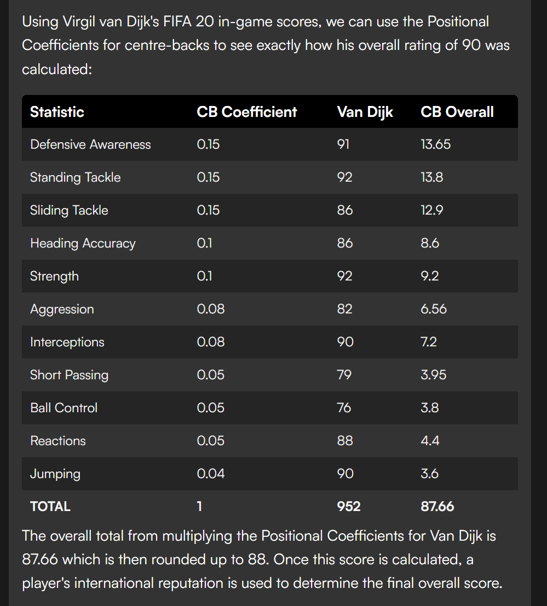

Player's OVR rating work on handful of stats categorires. In that some categories have greater importance/ weight on this calculation over another.

Certain stats are given "Positional Coefficients" which are mutliplied and added to assign an overall score. 

**Links:**

[Calculating FIFA 13 Player OVR Ratings](https://www.scribd.com/document/200818608/Here-is-a-Guide-to-How-FIFA-13-Calculates-the-OVR-Rating-for-a-Player)

[FIFA player ratings explained](https://www.goal.com/en/news/fifa-player-ratings-explained-how-are-the-card-number--stats-decided/1hszd2fgr7wgf1n2b2yjdpgynu)